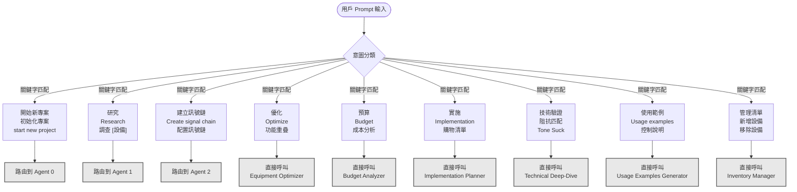
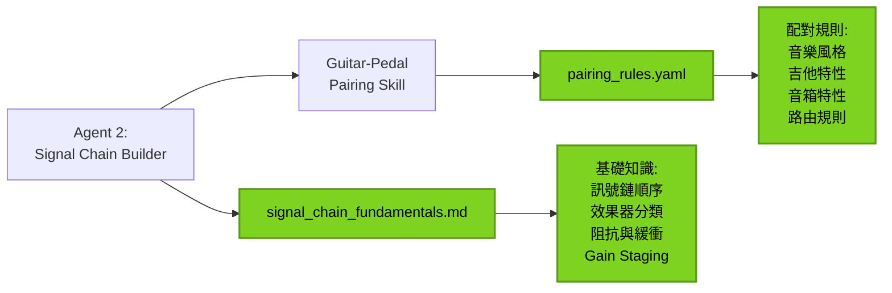

# PedalGuy Agent & Skill 決策流程圖

> 本文檔描述了當一個 Prompt 被輸入時，系統如何決定要呼叫哪個 Agent 處理，以及 Agent 會在何時呼叫哪個 Skill 來處理事情。

## 完整決策流程圖（UML 規範）

```mermaid
flowchart TD
    Start([用戶輸入 Prompt]) --> ParseIntent{解析用戶意圖}

    %% 主要分支：決定呼叫哪個 Agent
    ParseIntent -->|"開始新專案<br/>初始化專案"| Agent0[Agent 0:<br/>Project Initializer]
    ParseIntent -->|"研究 [設備]<br/>Research [Equipment]"| Agent1[Agent 1:<br/>Pedal Research Agent]
    ParseIntent -->|"建立訊號鏈<br/>Create Signal Chain"| Agent2[Agent 2:<br/>Signal Chain Builder]
    ParseIntent -->|"優化配置<br/>分析預算<br/>實施計劃"| DirectSkill{直接呼叫 Skill}

    %% ============================================
    %% Agent 0: Project Initializer 流程
    %% ============================================
    Agent0 --> A0_Check{檢查專案狀態}
    A0_Check -->|新專案| A0_CreateDirs[建立目錄結構<br/>shared/inventory/<br/>projects/]
    A0_Check -->|現有專案| A0_LoadExisting[載入現有清單]

    A0_CreateDirs --> A0_Interview[問答式收集設備清單]
    A0_LoadExisting --> A0_Interview

    A0_Interview --> A0_CallIM[呼叫 Skill:<br/>Inventory Manager]
    A0_CallIM --> A0_IM_Add[IM: Add Equipment]
    A0_IM_Add --> A0_File1[生成檔案:<br/>guitars.yaml<br/>pedals.yaml<br/>amps.yaml]

    A0_File1 --> A0_Menu{提供主選單}
    A0_Menu -->|"更新設備清單"| A0_CallIM
    A0_Menu -->|"建立詳細資料"| A0_ToAgent1[轉交給 Agent 1]
    A0_ToAgent1 --> Agent1
    A0_Menu -->|"建立訊號鏈"| A0_ToAgent2[轉交給 Agent 2]
    A0_ToAgent2 --> Agent2

    %% ============================================
    %% Agent 1: Pedal Research Agent 流程
    %% ============================================
    Agent1 --> A1_GetInput[接收研究目標<br/>品牌 + 型號]
    A1_GetInput --> A1_WebSearch[Web 搜尋<br/>優先級排序]

    A1_WebSearch --> A1_Source1[1. 官方網站]
    A1_WebSearch --> A1_Source2[2. 官方手冊 PDF]
    A1_WebSearch --> A1_Source3[3. 權威評測<br/>Premier Guitar<br/>Reverb, Sweetwater]
    A1_WebSearch --> A1_Source4[4. YouTube 評測<br/>TPS, JHS Pedals]
    A1_WebSearch --> A1_Source5[5. 用戶論壇<br/>僅參考]

    A1_Source1 --> A1_Analyze[資料整合與分析]
    A1_Source2 --> A1_Analyze
    A1_Source3 --> A1_Analyze
    A1_Source4 --> A1_Analyze
    A1_Source5 --> A1_Analyze

    A1_Analyze --> A1_Generate[生成雙格式報告]
    A1_Generate --> A1_File1[生成檔案 1:<br/>equipment_database/<br/>[type]/[brand]_[model]_v[N].md]
    A1_Generate --> A1_File2[生成檔案 2:<br/>equipment_database/<br/>[type]/[brand]_[model].yaml]

    A1_File1 --> A1_Option{詢問用戶後續操作}
    A1_File2 --> A1_Option

    A1_Option -->|"加入 Inventory"| A1_CallIM[呼叫 Skill:<br/>Inventory Manager]
    A1_CallIM --> A1_IM_Update[IM: Add/Update Equipment]
    A1_IM_Update --> A1_UpdateYAML[更新 inventory/*.yaml]

    A1_Option -->|"生成使用範例"| A1_CallUE[呼叫 Skill:<br/>Usage Examples Generator]
    A1_CallUE --> A1_UE_Parse[UE: 解析 YAML + MD]
    A1_UE_Parse --> A1_UE_Generate[UE: 生成完整範例]
    A1_UE_Generate --> A1_File3[生成檔案 3:<br/>equipment_database/pedals/<br/>examples/[pedal_id]_examples.md]

    A1_UpdateYAML --> A1_End([Agent 1 完成])
    A1_File3 --> A1_End
    A1_Option -->|"不需要"| A1_End

    %% ============================================
    %% Agent 2: Signal Chain Builder 流程
    %% ============================================
    Agent2 --> A2_Interview[問答式收集需求]
    A2_Interview --> A2_Q1[Q1: 選擇吉他<br/>from inventory]
    A2_Q1 --> A2_Q2[Q2: 選擇音箱<br/>from inventory]
    A2_Q2 --> A2_Q3[Q3: 選擇音樂風格]
    A2_Q3 --> A2_Q4{Q4: 是否啟用<br/>預算分析?}

    A2_Q4 -->|是| A2_Budget[budget_enabled = true]
    A2_Q4 -->|否| A2_NoBudget[budget_enabled = false]

    A2_Budget --> A2_LoadInv[載入設備資料]
    A2_NoBudget --> A2_LoadInv

    A2_LoadInv --> A2_ReadYAML[讀取 Inventory YAML]
    A2_ReadYAML --> A2_CallPairing[呼叫 Skill:<br/>Guitar-Pedal Pairing]

    A2_CallPairing --> A2_Pairing_Algo[配對算法執行]
    A2_Pairing_Algo --> A2_Weight[多因素權重計算:<br/>音樂風格 40%<br/>吉他特性 30%<br/>音箱特性 20%<br/>使用情境 10%]

    A2_Weight --> A2_ReadKnowledge[讀取 Knowledge:<br/>pairing_rules.yaml<br/>signal_chain_fundamentals.md]
    A2_ReadKnowledge --> A2_PairingResult[配對結果:<br/>compressor, overdrive<br/>eq, delay, reverb]

    A2_PairingResult --> A2_DecideMethod{決定訊號鏈方法}
    A2_DecideMethod -->|音箱有 FX Loop| A2_4Cable[4-Cable Method]
    A2_DecideMethod -->|音箱無 FX Loop| A2_PreAmp[Pre-Amp Only]

    A2_4Cable --> A2_SwissThings{是否使用<br/>Swiss Things?}
    A2_PreAmp --> A2_SwissThings

    A2_SwissThings -->|是| A2_SwissRoute[Swiss Things 路由分配]
    A2_SwissThings -->|否| A2_DirectRoute[標準訊號鏈路由]

    A2_SwissRoute --> A2_Generate[生成完整配置]
    A2_DirectRoute --> A2_Generate

    A2_Generate --> A2_File1[生成檔案 1:<br/>signal_chains/<br/>[style]_[guitar]_[amp]_v[N].md<br/>含 ASCII 流程圖]
    A2_Generate --> A2_File2[生成檔案 2:<br/>signal_chains/<br/>[style]_[guitar]_[amp]_v[N].yaml]

    A2_File1 --> A2_OptionalSkills{詢問後續操作}
    A2_File2 --> A2_OptionalSkills

    A2_OptionalSkills -->|"優化配置"| A2_CallEO[呼叫 Skill:<br/>Equipment Optimizer]
    A2_OptionalSkills -->|"預算分析"| A2_CallBA[呼叫 Skill:<br/>Budget Analyzer]
    A2_OptionalSkills -->|"實施計劃"| A2_CallIP[呼叫 Skill:<br/>Implementation Planner]
    A2_OptionalSkills -->|"技術驗證"| A2_CallTD[呼叫 Skill:<br/>Technical Deep-Dive]

    %% Equipment Optimizer
    A2_CallEO --> EO_Analyze[EO: 功能重叠检测]
    EO_Analyze --> EO_UsageRate[EO: 使用率分析]
    EO_UsageRate --> EO_Report[生成優化報告]
    EO_Report --> A2_End([Agent 2 完成])

    %% Budget Analyzer
    A2_CallBA --> BA_Calc[BA: 總投資計算]
    BA_Calc --> BA_CostFunc[BA: Cost-per-Function]
    BA_CostFunc --> BA_ROI[BA: ROI 計算]
    BA_ROI --> BA_Priority[BA: 購買優先順序]
    BA_Priority --> A2_End

    %% Implementation Planner
    A2_CallIP --> IP_Phase[IP: 分階段計劃<br/>Phase 1-5]
    IP_Phase --> IP_Shopping[IP: 購物清單生成<br/>Pedalboard 尺寸<br/>電源計算<br/>線材需求]
    IP_Shopping --> IP_Layout[IP: Pedalboard 佈局<br/>ASCII 圖表]
    IP_Layout --> IP_File[生成檔案:<br/>implementation_plan_v[N].md]
    IP_File --> A2_End

    %% Technical Deep-Dive
    A2_CallTD --> TD_Impedance[TD: 阻抗匹配分析]
    TD_Impedance --> TD_Compare[TD: 功能差異比較]
    TD_Compare --> TD_Signal[TD: 訊號路徑驗證]
    TD_Signal --> TD_ToneSuck[TD: Tone Suck 分析]
    TD_ToneSuck --> TD_Report[生成技術報告]
    TD_Report --> A2_End

    A2_OptionalSkills -->|"不需要"| A2_End

    %% ============================================
    %% 直接呼叫 Skill 的流程
    %% ============================================
    DirectSkill -->|"優化我的配置"| DS_EO[直接呼叫:<br/>Equipment Optimizer]
    DirectSkill -->|"預算分析"| DS_BA[直接呼叫:<br/>Budget Analyzer]
    DirectSkill -->|"實施計劃"| DS_IP[直接呼叫:<br/>Implementation Planner]
    DirectSkill -->|"技術驗證"| DS_TD[直接呼叫:<br/>Technical Deep-Dive]
    DirectSkill -->|"生成使用範例"| DS_UE[直接呼叫:<br/>Usage Examples Generator]
    DirectSkill -->|"管理清單"| DS_IM[直接呼叫:<br/>Inventory Manager]

    DS_EO --> SkillEnd([Skill 執行完成])
    DS_BA --> SkillEnd
    DS_IP --> SkillEnd
    DS_TD --> SkillEnd
    DS_UE --> SkillEnd
    DS_IM --> SkillEnd

    %% 樣式定義
    classDef agentClass fill:#4A90E2,stroke:#2E5C8A,stroke-width:3px,color:#fff
    classDef skillClass fill:#50C878,stroke:#2E7D4E,stroke-width:2px,color:#fff
    classDef fileClass fill:#F5A623,stroke:#C77E00,stroke-width:2px,color:#000
    classDef decisionClass fill:#BD10E0,stroke:#7A0099,stroke-width:2px,color:#fff
    classDef knowledgeClass fill:#7ED321,stroke:#5A9A18,stroke-width:2px,color:#000

    class Agent0,Agent1,Agent2 agentClass
    class A0_CallIM,A1_CallIM,A1_CallUE,A2_CallPairing,A2_CallEO,A2_CallBA,A2_CallIP,A2_CallTD,DS_EO,DS_BA,DS_IP,DS_TD,DS_UE,DS_IM skillClass
    class A0_File1,A1_File1,A1_File2,A1_File3,A2_File1,A2_File2,IP_File fileClass
    class ParseIntent,A0_Check,A0_Menu,A1_Option,A2_Q4,A2_DecideMethod,A2_SwissThings,A2_OptionalSkills,DirectSkill decisionClass
    class A2_ReadKnowledge knowledgeClass
```

---

## 圖例說明

| 顏色 | 元素類型 | 說明 |
|------|---------|------|
| 🔵 藍色 | Agent | 三個主要 Agent (0, 1, 2) |
| 🟢 綠色 | Skill | 七個可呼叫的 Skill |
| 🟠 橙色 | 檔案輸出 | 系統生成的檔案 |
| 🟣 紫色 | 決策點 | 條件判斷與分支 |
| 🟡 黃綠色 | 知識庫 | Knowledge 資料來源 |

---

## 決策樹：Prompt 意圖分類



---

## Skills 呼叫時機與生成檔案總覽

| Skill 名稱 | 呼叫者 | 呼叫時機 | 生成檔案 |
|-----------|-------|---------|---------|
| **Inventory Manager** | Agent 0, Agent 1, 用戶直接呼叫 | 專案初始化、設備新增/更新/移除 | `shared/inventory/guitars.yaml`<br/>`shared/inventory/pedals.yaml`<br/>`shared/inventory/amps.yaml` |
| **Guitar-Pedal Pairing** | Agent 2 | 建立訊號鏈配置時 | 無直接檔案（返回配對結果給 Agent 2） |
| **Usage Examples Generator** | Agent 1, 用戶直接呼叫 | 設備研究完成後（可選） | `shared/equipment_database/pedals/examples/[pedal_id]_examples.md` |
| **Equipment Optimizer** | Agent 2（可選）, 用戶直接呼叫 | 訊號鏈配置完成後，需要優化分析時 | 優化報告（通常附加在配置檔案中） |
| **Budget Analyzer** | Agent 2（可選）, 用戶直接呼叫 | 啟用預算分析選項時 | 預算分析報告（通常附加在配置檔案中） |
| **Implementation Planner** | Agent 2（可選）, 用戶直接呼叫 | 配置確定後，需要實施計劃時 | `projects/[project]/implementation_plan_v[N].md` |
| **Technical Deep-Dive** | 用戶直接呼叫 | 需要技術驗證時 | 技術分析報告 |

---

## Agent 與 Skill 協作矩陣

|  | Inventory Manager | Guitar-Pedal Pairing | Usage Examples | Equipment Optimizer | Budget Analyzer | Implementation Planner | Technical Deep-Dive |
|---|:---:|:---:|:---:|:---:|:---:|:---:|:---:|
| **Agent 0: Project Initializer** | ✅ 必定呼叫 | ❌ | ❌ | ❌ | ❌ | ❌ | ❌ |
| **Agent 1: Pedal Research** | 🟡 可選呼叫 | ❌ | 🟡 可選呼叫 | ❌ | ❌ | ❌ | ❌ |
| **Agent 2: Signal Chain Builder** | 📖 僅讀取 | ✅ 必定呼叫 | ❌ | 🟡 可選呼叫 | 🟡 可選呼叫 | 🟡 可選呼叫 | 🟡 可選呼叫 |
| **用戶直接呼叫** | ✅ 支援 | ❌ | ✅ 支援 | ✅ 支援 | ✅ 支援 | ✅ 支援 | ✅ 支援 |

**圖例**:
- ✅ 必定呼叫
- 🟡 可選呼叫（根據用戶選擇）
- 📖 僅讀取數據（不呼叫 Skill 邏輯）
- ❌ 不呼叫

---

## 檔案生成完整列表

### Agent 0: Project Initializer 生成的檔案
```
shared/
└── inventory/
    ├── guitars.yaml
    ├── pedals.yaml
    └── amps.yaml
```

### Agent 1: Pedal Research Agent 生成的檔案
```
shared/
└── equipment_database/
    ├── guitars/
    │   ├── [brand]_[model]_v[N].md
    │   └── [brand]_[model].yaml
    ├── pedals/
    │   ├── [brand]_[model]_v[N].md
    │   ├── [brand]_[model].yaml
    │   └── examples/
    │       └── [pedal_id]_examples.md  ← Usage Examples Generator
    └── amps/
        ├── [brand]_[model]_v[N].md
        └── [brand]_[model].yaml
```

### Agent 2: Signal Chain Builder 生成的檔案
```
projects/
└── [project_name]/
    ├── signal_chains/
    │   ├── [style]_[guitar]_[amp]_v[N].md
    │   └── [style]_[guitar]_[amp]_v[N].yaml
    └── implementation_plan_v[N].md  ← Implementation Planner
```

---

## 知識庫依賴關係



---

## 典型工作流程範例

### 範例 1：完整流程（從零開始）

```
用戶: "開始新的效果器研究專案"
└─> Agent 0 啟動
    ├─> 建立目錄結構
    ├─> 問答收集設備清單
    ├─> 呼叫 Inventory Manager
    └─> 生成 guitars.yaml, pedals.yaml, amps.yaml

用戶: "研究 Strymon BigSky"
└─> Agent 1 啟動
    ├─> Web Search (官網 → YouTube → 評測)
    ├─> 生成 strymon_bigsky_v1.md
    ├─> 生成 strymon_bigsky.yaml
    ├─> 詢問是否加入 Inventory → 呼叫 Inventory Manager
    └─> 詢問是否生成使用範例 → 呼叫 Usage Examples Generator
        └─> 生成 strymon_bigsky_examples.md

用戶: "建立訊號鏈配置"
└─> Agent 2 啟動
    ├─> 問答收集需求（吉他/音箱/風格）
    ├─> 載入 Inventory YAML
    ├─> 呼叫 Guitar-Pedal Pairing Skill
    │   └─> 讀取 pairing_rules.yaml
    ├─> 決定 4-Cable Method
    ├─> 生成 blues_stratocaster_princeton_v1.md
    └─> 生成 blues_stratocaster_princeton_v1.yaml

用戶: "優化我的配置"
└─> 呼叫 Equipment Optimizer
    ├─> 功能重疊檢測
    ├─> 使用率分析
    └─> 提供優化建議

用戶: "生成實施計劃"
└─> 呼叫 Implementation Planner
    ├─> 分階段計劃 (Phase 1-5)
    ├─> 購物清單（Pedalboard/電源/線材）
    ├─> Pedalboard 佈局 ASCII 圖
    └─> 生成 implementation_plan_v1.md
```

### 範例 2：快速研究流程

```
用戶: "研究 Boss BD-2"
└─> Agent 1 啟動
    ├─> Web Search
    ├─> 生成 boss_bd2_v1.md + boss_bd2.yaml
    └─> 完成（不加入 Inventory，不生成範例）
```

### 範例 3：直接呼叫 Skill

```
用戶: "預算分析"
└─> 直接呼叫 Budget Analyzer
    ├─> 讀取 Inventory YAML
    ├─> 計算總投資
    ├─> Cost-per-Function 分析
    ├─> ROI 計算
    └─> 提供購買優先順序
```

---

## 決策邏輯總結

### 1. Prompt 意圖識別
系統通過關鍵字匹配來識別用戶意圖：
- **專案管理關鍵字**: 開始、初始化、start, new project → Agent 0
- **研究關鍵字**: 研究、Research, 調查 → Agent 1
- **配置關鍵字**: 建立訊號鏈、Create signal chain, 配置 → Agent 2
- **優化關鍵字**: 優化、Optimize, 功能重疊 → Equipment Optimizer
- **預算關鍵字**: 預算、Budget, 成本 → Budget Analyzer
- **實施關鍵字**: 實施、Implementation, 購物清單 → Implementation Planner
- **技術關鍵字**: 技術驗證、阻抗匹配、Tone Suck → Technical Deep-Dive
- **範例關鍵字**: 使用範例、Usage examples → Usage Examples Generator
- **清單關鍵字**: 管理清單、新增設備 → Inventory Manager

### 2. Agent 呼叫 Skill 的時機
- **Agent 0**: 永遠呼叫 Inventory Manager（專案初始化必需）
- **Agent 1**:
  - 可選呼叫 Inventory Manager（用戶選擇加入清單時）
  - 可選呼叫 Usage Examples Generator（用戶選擇生成範例時）
- **Agent 2**:
  - 必定呼叫 Guitar-Pedal Pairing（配對核心邏輯）
  - 可選呼叫其他 4 個 Skills（根據用戶需求）

### 3. 檔案生成時機
- **立即生成**: Agent 執行完成後立即生成 MD + YAML
- **可選生成**: Skills 根據用戶選擇決定是否生成
- **版本控制**: 所有檔案支援版本號 (v1, v2, ...)

---

## 技術架構特點

1. **模組化設計**: Agents 和 Skills 職責清晰，低耦合
2. **雙格式輸出**: Markdown (人類) + YAML (AI)
3. **知識驅動**: 基於 pairing_rules.yaml 和 signal_chain_fundamentals.md
4. **渐进式工作流**: 初始化 → 研究 → 配對 → 優化 → 實施
5. **可擴展性**: 新增設備或規則無需修改核心邏輯

---

**建立日期**: 2026-01-11
**版本**: 1.0
**作者**: Claude Code Agent
